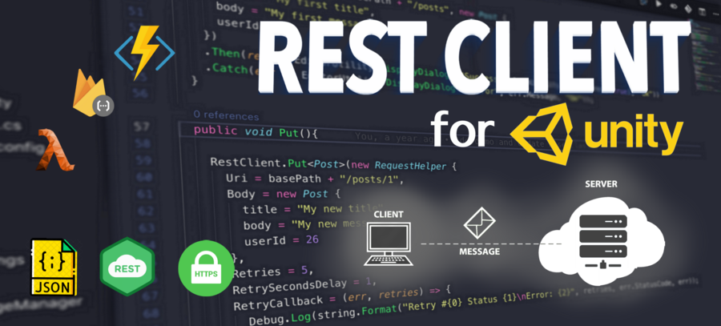
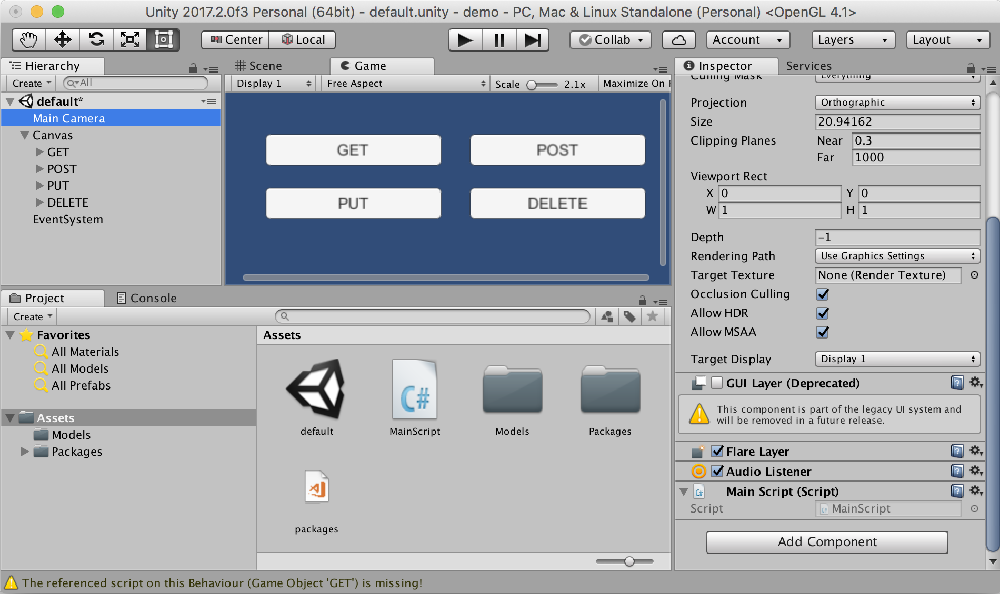
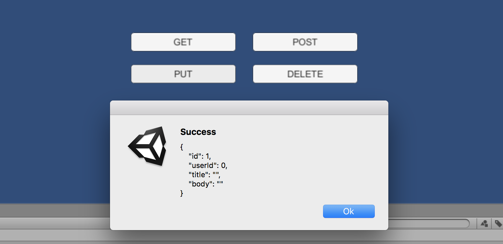

[](./LICENSE)
[](https://app.codacy.com/app/jdnichollsc/RestClient?utm_source=github.com&utm_medium=referral&utm_content=proyecto26/RestClient&utm_campaign=Badge_Grade_Dashboard)
[](https://github.com/proyecto26/RestClient/graphs/commit-activity)
[](https://tidelift.com/subscription/pkg/nuget-proyecto26-restclient?utm_source=nuget-proyecto26-restclient&utm_medium=referral&utm_campaign=readme)
[](https://travis-ci.org/proyecto26/RestClient)
[![Twitter Follow][twitter-image]][twitter-url]
<!-- TODO: Refactor code [](https://bettercodehub.com/)--> 

[twitter-image]:https://img.shields.io/twitter/follow/jdnichollsc.svg?style=social&label=Follow%20me
[twitter-url]:https://twitter.com/jdnichollsc

# RestClient for Unity 🤘




This **HTTP/REST** Client is based on Promises to avoid the [Callback Hell](http://callbackhell.com/) ☠️ and the [Pyramid of doom](https://en.wikipedia.org/wiki/Pyramid_of_doom_(programming)) 💩 working with **Coroutines** in **Unity** 🎮, example:

```csharp
var api = "https://jsonplaceholder.typicode.com";
RestClient.GetArray<Post>(api + "/posts", (err, res) => {
  RestClient.GetArray<Todo>(api + "/todos", (errTodos, resTodos) => {
    RestClient.GetArray<User>(api + "/users", (errUsers, resUsers) => {
      //Missing validations to catch errors!
    });
  });
});
```

But working with **Promises** we can improve our code, yay! 👏

```csharp
RestClient.GetArray<Post>(api + "/posts").Then(response => {
  EditorUtility.DisplayDialog ("Success", JsonHelper.ArrayToJson<Post>(response, true), "Ok");
  return RestClient.GetArray<Todo>(api + "/todos");
}).Then(response => {
  EditorUtility.DisplayDialog ("Success", JsonHelper.ArrayToJson<Todo>(response, true), "Ok");
  return RestClient.GetArray<User>(api + "/users");
}).Then(response => {
  EditorUtility.DisplayDialog ("Success", JsonHelper.ArrayToJson<User>(response, true), "Ok");
}).Catch(err => EditorUtility.DisplayDialog ("Error", err.Message, "Ok"));
```

## Features 🎮
- Works out of the box 🎉 
- Supports **HTTPS/SSL**
- Built on top of **UnityWebRequest** system
- Includes JSON serialization with **JsonUtility** (Other tools are supported!)
- Get **Arrays** Supported
- Default **HTTP** Methods **(GET, POST, PUT, DELETE, HEAD)**
- Generic **REQUEST** method to create any http request
- Based on **Promises** for a better asynchronous programming. Learn about Promises [here](https://github.com/Real-Serious-Games/C-Sharp-Promise)!
- Handle HTTP exceptions in a better way
- Retry HTTP requests easily
- Open Source 🦄

## Supported platforms 📱 🖥 
The [UnityWebRequest](https://docs.unity3d.com/Manual/UnityWebRequest.html) system supports most Unity platforms:

* All versions of the Editor and Standalone players
* WebGL
* Mobile platforms: iOS, Android
* Universal Windows Platform
* PS4 and PSVita
* XboxOne
* HoloLens
* Nintendo Switch

## Demo ⏯
Do you want to see this beautiful package in action? Download the demo [here](https://minhaskamal.github.io/DownGit/#/home?url=https://github.com/proyecto26/RestClient/tree/master/demo)




## Installation 👨‍💻

### Unity package
Download and install the **.unitypackage** file of the latest release published [here](https://github.com/proyecto26/RestClient/releases).

### Nuget package
Other option is download this package from **NuGet** with **Visual Studio** or using the **nuget-cli**, a **[NuGet.config](https://github.com/proyecto26/RestClient/blob/master/demo/NuGet.config)** file is required at the root of your **Unity Project**, for example:

```xml
<?xml version="1.0" encoding="utf-8"?>
<configuration>
  <config>
    <add key="repositoryPath" value="./Assets/Packages" />
  </config>
</configuration>
```
The package to search for is **[Proyecto26.RestClient](https://www.nuget.org/packages/Proyecto26.RestClient/)**.

## Getting Started 📚
The default methods **(GET, POST, PUT, DELETE, HEAD)** are:
```csharp
RestClient.Get("https://jsonplaceholder.typicode.com/posts/1").Then(response => {
  EditorUtility.DisplayDialog("Response", response.Text, "Ok");
});
RestClient.Post("https://jsonplaceholder.typicode.com/posts", newPost).Then(response => {
  EditorUtility.DisplayDialog("Status", response.StatusCode.ToString(), "Ok");
});
RestClient.Put("https://jsonplaceholder.typicode.com/posts/1", updatedPost).Then(response => {
  EditorUtility.DisplayDialog("Status", response.StatusCode.ToString(), "Ok");
});
RestClient.Delete("https://jsonplaceholder.typicode.com/posts/1").Then(response => {
  EditorUtility.DisplayDialog("Status", response.StatusCode.ToString(), "Ok");
});
RestClient.Head("https://jsonplaceholder.typicode.com/posts").Then(response => {
  EditorUtility.DisplayDialog("Status", response.StatusCode.ToString(), "Ok");
});
```

### Generic Request Method
And we have a generic method to create any type of request:
```csharp
RestClient.Request(new RequestHelper { 
  Uri = "https://jsonplaceholder.typicode.com/photos",
  Method = "POST",
  Timeout = 10,
  Params = new Dictionary<string, string> {
    { "param1", "Query string param..." }
  },
  Headers = new Dictionary<string, string> {
    { "Authorization", "Bearer JWT_token..." }
  },
  Body = newPhoto, //Serialize object using JsonUtility by default
  BodyString = SerializeObject(newPhoto), //Use it instead of 'Body' to serialize using other tools
  BodyRaw = CompressToRawData(newPhoto), //Use it instead of 'Body' to send raw data directly
  FormData = new WWWForm(), //Send files, etc with POST requests
  SimpleForm = new Dictionary<string, string> {}, //Content-Type: application/x-www-form-urlencoded
  FormSections = new List<IMultipartFormSection>() {}, //Content-Type: multipart/form-data
  CertificateHandler = new CustomCertificateHandler(), //Create custom certificates
  UploadHandler = new UploadHandlerRaw(bytes), //Send bytes directly if it's required
  DownloadHandler = new DownloadHandlerFile(destPah), //Download large files
  ContentType = "application/json", //JSON is used by default
  Retries = 3, //Number of retries
  RetrySecondsDelay = 2, //Seconds of delay to make a retry
  RetryCallback = (err, retries) => {}, //See the error before retrying the request
  EnableDebug = true, //See logs of the requests for debug mode
  IgnoreHttpException = true, //Prevent to catch http exceptions
  ChunkedTransfer = false,
  UseHttpContinue = true,
  RedirectLimit = 32,
  DefaultContentType = false, //Disable JSON content type by default
  ParseResponseBody = false //Don't encode and parse downloaded data as JSON
}).Then(response => {
  //Get resources via downloadHandler to get more control!
  Texture texture = ((DownloadHandlerTexture)response.Request.downloadHandler).texture;
  AudioClip audioClip = ((DownloadHandlerAudioClip)response.Request.downloadHandler).audioClip;
  AssetBundle assetBundle = ((DownloadHandlerAssetBundle)response.Request.downloadHandler).assetBundle;

  EditorUtility.DisplayDialog("Status", response.StatusCode.ToString(), "Ok");
});
```

- Example downloading an audio file:
```csharp
var fileUrl = "https://raw.githubusercontent.com/IonDen/ion.sound/master/sounds/bell_ring.ogg";
var fileType = AudioType.OGGVORBIS;

RestClient.Get(new RequestHelper {
  Uri = fileUrl,
  DownloadHandler = new DownloadHandlerAudioClip(fileUrl, fileType)
}).Then(res => {
  AudioSource audio = GetComponent<AudioSource>();
  audio.clip = ((DownloadHandlerAudioClip)res.Request.downloadHandler).audioClip;
  audio.Play();
}).Catch(err => {
  EditorUtility.DisplayDialog ("Error", err.Message, "Ok");
});
```

With all the methods we have the possibility to indicate the type of response, in the following example we're going to create a class and the **HTTP** requests to load **JSON** data easily:
```csharp
[Serializable]
public class User
{
  public int id;
  public string name;
  public string username;
  public string email;
  public string phone;
  public string website;
}
```

* **GET JSON**
```csharp
var usersRoute = "https://jsonplaceholder.typicode.com/users"; 
RestClient.Get<User>(usersRoute + "/1").Then(firstUser => {
  EditorUtility.DisplayDialog("JSON", JsonUtility.ToJson(firstUser, true), "Ok");
});
```
* **GET Array (JsonHelper is an extension to manage arrays)**
```csharp
RestClient.GetArray<User>(usersRoute).Then(allUsers => {
  EditorUtility.DisplayDialog("JSON Array", JsonHelper.ArrayToJsonString<User>(allUsers, true), "Ok");
});
```

Also we can create different classes for custom responses:
```csharp
[Serializable]
public class CustomResponse
{
  public int id;
}
```
* **POST**
```csharp
RestClient.Post<CustomResponse>(usersRoute, newUser).Then(customResponse => {
  EditorUtility.DisplayDialog("JSON", JsonUtility.ToJson(customResponse, true), "Ok");
});
```
* **PUT**
```csharp
RestClient.Put<CustomResponse>(usersRoute + "/1", updatedUser).Then(customResponse => {
  EditorUtility.DisplayDialog("JSON", JsonUtility.ToJson(customResponse, true), "Ok");
});
```

## Custom HTTP Headers, Params and Options 💥
**HTTP Headers**, such as `Authorization`, can be set in the **DefaultRequestHeaders** object for all requests
```csharp
RestClient.DefaultRequestHeaders["Authorization"] = "Bearer ...";
```

**Query string params** can be set in the **DefaultRequestParams** object for all requests
```csharp
RestClient.DefaultRequestParams["param1"] = "Query string value...";
```

Also we can add specific options and override default headers and params for a request
```csharp
var currentRequest = new RequestHelper { 
  Uri = "https://jsonplaceholder.typicode.com/photos",
  Headers = new Dictionary<string, string> {
    { "Authorization", "Other token..." }
  },
  Params = new Dictionary<string, string> {
    { "param1", "Other value..." }
  }
};
RestClient.GetArray<Photo>(currentRequest).Then(response => {
  EditorUtility.DisplayDialog("Header", currentRequest.GetHeader("Authorization"), "Ok");
});
```

And we can know the status of the request and cancel it!
```csharp
currentRequest.UploadProgress; //The progress by uploading data to the server
currentRequest.UploadedBytes; //The number of bytes of body data the system has uploaded
currentRequest.DownloadProgress; //The progress by downloading data from the server
currentRequest.DownloadedBytes; //The number of bytes of body data the system has downloaded
currentRequest.Abort(); //Abort the request manually
```

Later we can clear the default headers and params for all requests
```csharp
RestClient.ClearDefaultHeaders();
RestClient.ClearDefaultParams();
```

### Example
- Unity as Client
```csharp
[Serializable]
public class ServerResponse {
  public string id;
  public string date; //DateTime is not supported by JsonUtility
}
[Serializable]
public class User {
  public string firstName;
  public string lastName;
}
RestClient.Post<ServerResponse>("www.api.com/endpoint", new User {
  firstName = "Juan David",
  lastName = "Nicholls Cardona"
}).Then(response => {
  EditorUtility.DisplayDialog("ID: ", response.id, "Ok");
  EditorUtility.DisplayDialog("Date: ", response.date, "Ok");
});
```
- NodeJS as Backend (Using [Express](http://expressjs.com/es/starter/hello-world.html))
```js
router.post('/', function(req, res) {
  console.log(req.body.firstName)
  res.json({
    id: 123,
    date: new Date()
  })
});
```

## Collaborators 🥇
[](https://github.com/jdnichollsc) | [](https://github.com/diegoossa) | [](https://github.com/nasdull) |
:---: | :---: | :---: |
[Juan Nicholls](mailto:jdnichollsc@hotmail.com) | [Diego Ossa](mailto:diegoossa@gmail.com) | [Nasdull](mailto:nasdull@hotmail.com) |

## Credits 👍
* **Promises library for C#:** [Real Serious Games/C-Sharp-Promise](https://github.com/Real-Serious-Games/C-Sharp-Promise)

## Supporting 🍻
I believe in Unicorns 🦄
Support [me](http://www.paypal.me/jdnichollsc/2), if you do too.
[Professionally supported Proyecto26.RestClient is coming soon](https://tidelift.com/subscription/pkg/nuget-proyecto26-restclient?utm_source=nuget-proyecto26-restclient&utm_medium=referral&utm_campaign=readme)

Hey mate, any good review from the [Unity Store](https://assetstore.unity.com/packages/tools/network/rest-client-for-unity-102501) is also really appreciated!

## Security contact information 🚨
To report a security vulnerability, please use the [Tidelift security contact](https://tidelift.com/security). Tidelift will coordinate the fix and disclosure.

## Happy coding 💯
Made with ❤️


